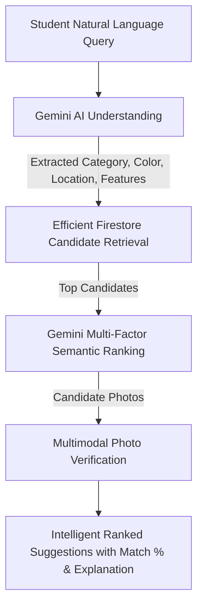

# 🔗 RetrieVIT — AI-Powered Campus Lost & Found Assistant

> **Lost Something at VIT? Let Gemini AI Suggest the Most Relevant Found Items.**

RetrieVIT is an AI course web application designed specifically for the Vellore Institute of Technology (VIT) campus. It bridges the natural language gap between how owners describe their lost items and how finders report found belongings.

---

## 🎯 Core Problem & Purpose

Students on campus frequently lose essential items — wallets, calculators, earbuds, student IDs, laptops, bottles, and keys across SJT, TT, PRP, Foodys, Central Library, and hostel blocks.
Information previously ended up scattered across chaotic WhatsApp groups, Instagram stories, or lost at security desks.

The fundamental AI challenge is:
- **Owners** search with emotional, descriptive language: *"I lost my black purse near SJT yesterday evening with a silver keychain and student ID inside."*
- **Finders** report with quick, vague summaries: *"Found black handbag near SJT ground floor bench."*

RetrieVIT solves this by using **Google Gemini AI** for semantic comprehension, multi-factor ranking, and photo verification — delivering intelligent ranked suggestions rather than simple keyword matches.

---

## 🏗️ Architecture & Suggestion Pipeline



### 1. Efficient Candidate Retrieval (Backend Concept)
Indexed Firestore queries quickly filter down campus candidates by active status and candidate categories without brute-forcing the entire database.

### 2. Intelligent AI Ranking (Gemini AI Brain)
Candidates are batched and evaluated by Google Gemini using multi-factor scoring:
- **Semantic description alignment** (wording variation, category synonymy)
- **Campus location proximity** (e.g. SJT classrooms vs SJT Foodys)
- **Temporal proximity** (date/time bounds)
- **Distinct physical features & materials** (keychains, stickers, scratches)

### 3. Multimodal Photo Verification
If both reports or the found item has a photo, visual verification acts as supporting evidence to boost or calibrate suggestion confidence.

### 4. Zero Fabricated AI Results
Suggestions are strictly derived from real Firestore documents. If external AI services encounter network rate limits or outages, deterministic keyword & attribute matching acts as a resilient fallback — fake or hallucinated records are never returned.

---

## 🛡️ Key Features

1. **Google Sign-In with VIT Domain Restriction**
   - Strictly restricted to `@vitstudent.ac.in` Google accounts.
   - Conservative VIT registration number extraction (e.g. `21BCE1234` auto-filled if clearly present in the student email; otherwise left for manual student input).
   - Phone / WhatsApp number captured during initial profile setup for verified handoffs.

2. **Finder-Side Status Lifecycle**
   Finders explicitly track and update where the found item is located at any moment:
   - 🎒 **In My Possession** (`with_finder`)
   - 📍 **At the Place Where Found** (`at_location`)
   - 🛡️ **Given to Security** (`with_security`) — includes the specific security desk / officer details (e.g. *SJT 1st Floor Main Desk*)
   - ✅ **Returned to Owner** (`returned_to_owner`)

3. **Private Contact Handoff**
   - Personal student phone numbers and WhatsApp links are never exposed publicly.
   - Claimants send a private inquiry with proof of ownership.
   - Contact details are unlocked only when the student accepts the request.

4. **Conversational Campus AI Assistant**
   - Direct interactive chat powered by Google Gemini to help students write high-quality reports, identify campus security deposit locations, and understand AI match scores.

---

## ⚙️ Environment Configuration

Configuration is managed securely via `.env`. No API keys or service credentials are hardcoded or exposed in frontend scripts.

Create a `.env` file in the project root:

```env
# Server
PORT=3000
NODE_ENV=development

# Google Gemini API
GEMINI_API_KEY=your_gemini_api_key_here
GEMINI_MODEL=gemini-1.5-flash

# Firebase Admin SDK (Server)
FIREBASE_SERVICE_ACCOUNT_PATH=./serviceAccountKey.json
FIREBASE_STORAGE_BUCKET=your-project.appspot.com

# Firebase Client SDK (Exposed safely to browser)
FIREBASE_CLIENT_API_KEY=your_client_api_key
FIREBASE_CLIENT_AUTH_DOMAIN=your-project.firebaseapp.com
FIREBASE_CLIENT_PROJECT_ID=your-project-id
FIREBASE_CLIENT_STORAGE_BUCKET=your-project.appspot.com
FIREBASE_CLIENT_MESSAGING_SENDER_ID=your_sender_id
FIREBASE_CLIENT_APP_ID=your_app_id
```

> **Note on Gemini Model Selection:**
> `GEMINI_MODEL` can be set to any supported free-tier Flash model (such as `gemini-1.5-flash`). If left blank, it defaults automatically to an available Flash model supporting multimodal inputs.

---

## 🚀 Getting Started

### 1. Install Dependencies
```bash
npm install
```

### 2. Configure Environment
Copy `.env.example` to `.env` and fill in your Gemini API key and Firebase credentials.

### 3. Seed Campus Sample Data (Optional)
```bash
npm run seed
```

### 4. Start the Application
```bash
npm start
```
Open `http://localhost:3000` in your browser.

---

## 🧪 Verification & Scenarios

| Scenario | Input | Expected Behavior |
|----------|-------|-------------------|
| **Vague Query** | `"black"` | Returns candidate black items with broad match confidence (40-50%). |
| **Category Query** | `"black purse"` | Narrows to bags/wallets, increases confidence score (70-75%). |
| **Location Query** | `"black purse near SJT"` | Incurs location proximity boost, prioritizes SJT reports (85-90%). |
| **Rich Detail Query** | `"black purse near SJT yesterday with silver chain"` | High confidence match (95%+), highlights specific silver chain feature match. |
| **Finder Status Update** | Finder changes status to "Given to Security" | Updates report in real-time, displays security desk details to claimants. |
| **Domain Restriction** | Non-VIT Google login | Immediate sign-out and denial alert: only `@vitstudent.ac.in` authorized. |
| **Private Handoff** | Claimant sends contact request | Recipient accepts inquiry, securely unlocking phone & WhatsApp contact info. |

---

## 📜 License
Developed for educational purposes at VIT. Released under the MIT License.
